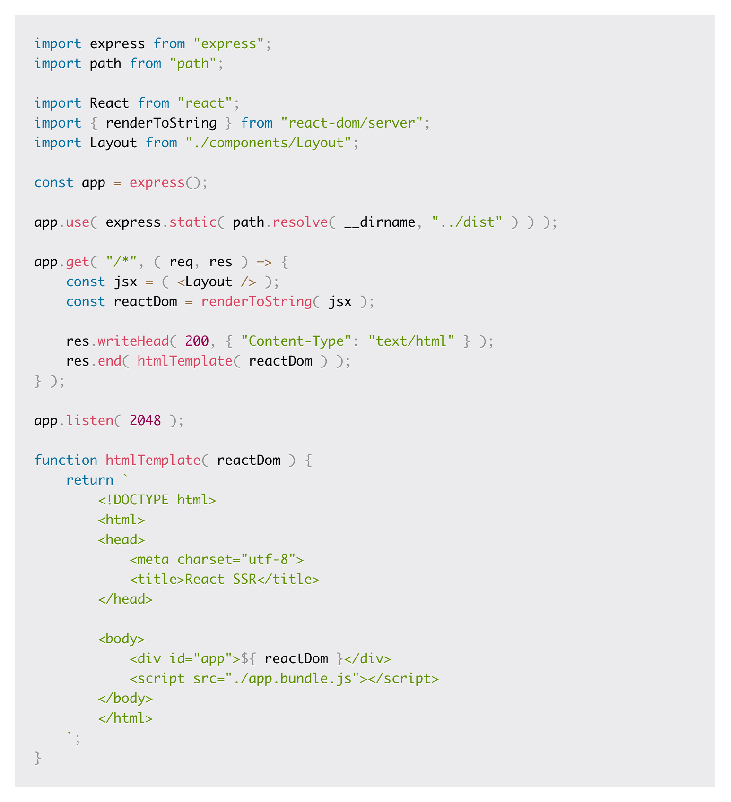
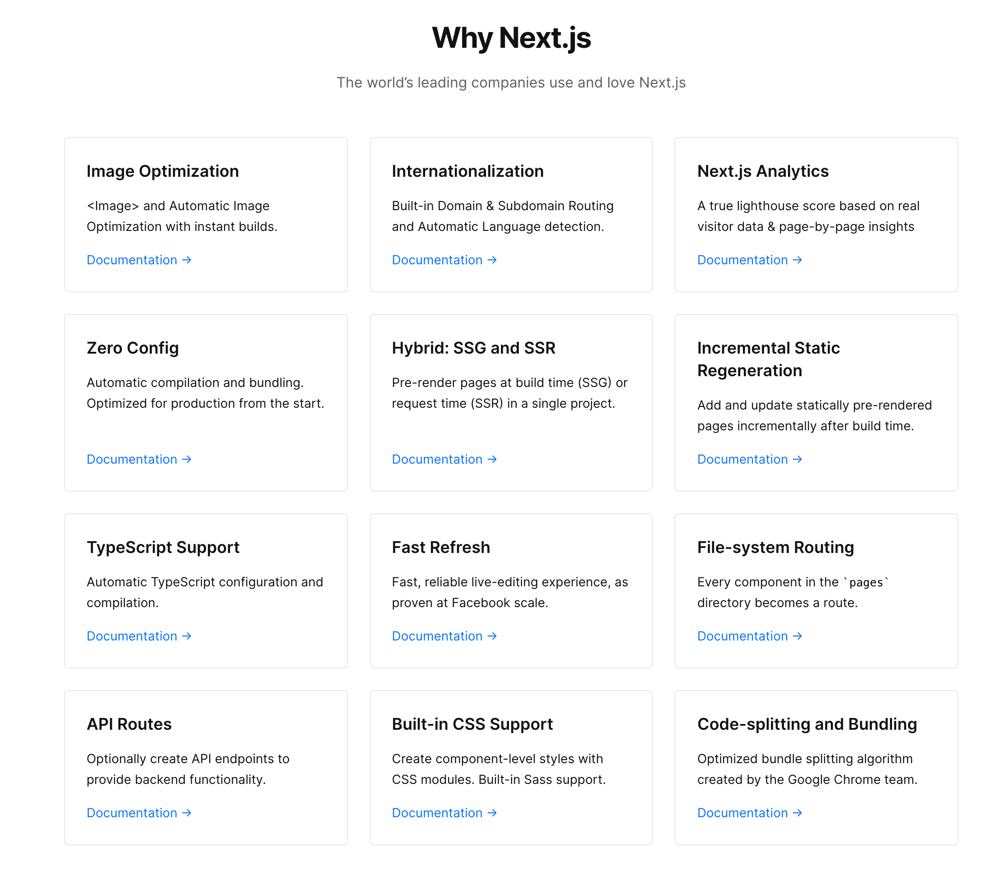
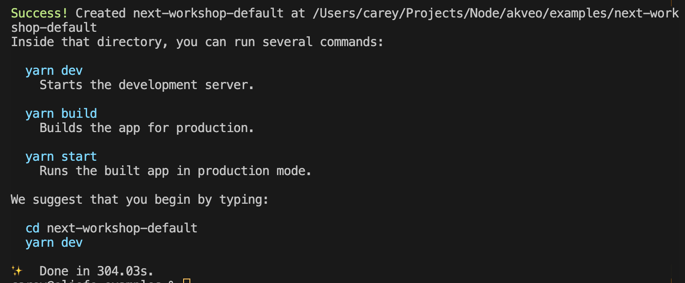

<div style="background-color: #181c35; color: #fff; padding: 1.5rem; display: flex; margin-bottom: 1rem;">
  
  <div>
    <div style="font-size: 2.2rem; font-weight: bold">NextJS Workshop</div>
    <p>Introduction to Next.js & Server Side Rendering</p>
  </div>
</div>

A Workshop demonstrating [Next.js](https://nextjs.org) and how to use it to develop Server Side Rendering Web Apps.

## What is SSR

SSR or Server Side Rendering is a concept where your web app is rendered initially on the server but then leverages the capabilities of a SPA or Single Page App on the client. 

Some call this process or this type of app, **Universal** or a **Universal App**. It can also be called an **Isomorphic App**.

In React you'll typically hear Isomorphic used such as in the case of a **useIsomorphicLayoutEffect** hook. Whereas with Angular its server side flavor is called **Universal Angular**.

The thing to remember is while these libraries differ greatly, they are talking about the same process of rendering on the server coupled with or leveraging a SPA on the client side.

## How SSR Works

Server side rendering whether it be React or even Angular Universal generally work the same as to their core principles. The entry point of the application is imported and run through a helper which stringifies it for a lack of a better term, it is then returned by the server as <code>text/html</code> content type just like any server might respond with a traditional HTML page.



[SSR Step By Step](https://www.freecodecamp.org/news/demystifying-reacts-server-side-render-de335d408fe4/)

[Angular SSR (Universal)](https://angular.io/guide/universal)

## Why SSR

- FCP or first content paint speed.
- SEO, more efficient web crawling.
- Improve speed on mobile, low powered devices.
- Useful when JavaScript runs poorly, limited yes but better than nothing.

## Why Next.js

Next.js takes all the goodness of [React](https://reactjs.org) andi turns it into a bulletproof production platform. Next is build with production in mind. Everything has been accounted for from a seamless development envioronment down to future proofed image optimization.

[](https://nextjs.org/)

### One of my Favorite Reasons

In two words **Fast Refresh**. The development experience is exceptional. Only what's needed to be rebuilt is rebuilt. Maintaining the component's state. It's quite enjoyable to use.

One gotcha! Use Functional Components and Hooks (sorry Alexei!!)

> As more of your codebase moves to function components and Hooks, you can expect state to be preserved in more cases.

### Quick Note on Fast Refresh

Add the following anywhere in your file that you wish to do a full remount.

```tsx
 // @refresh reset 
```

## Who's Using Next.js

Some of the largest companies in the world are using Next.js. 

- Netflix
- Uber
- Nike
- Starbucks
- Github
- Coinbase
- TikTok
- Hulu
- Docker
- Ticketmaster

[](https://nextjs.org/showcase)

## Installing Next.js 

You can install the Next.js boilerplate using either npm or yarn. See [NextJS Setup](https://nextjs.org/docs/getting-started) for additional information. 

The installer will ask what your app name or the relative directory to which Next.js should be installed. 

```sh
$ npx create-next-app --typescript
# OR
$ yarn create next-app --typescript
```

**You should see similar to the following once installed**



## How it Works

Next is built on top of React. It supports JSX which at first may seem odd to look at but in time you'll come to appreciate it as you see your logic and markup all in one file. It limits the number of files in your project as well. If you are using CSS to JS styling or you're using Styled jsx then you can conceivably have everything in a single file.

For large pages this is likely not ideal but from smaller components or components you wish to be portable it's outstanding!!

> Read more about [JSX here](https://reactjs.org/docs/introducing-jsx.html)

Next.js is a hybrid platform. It renders from the server but enables app like feel when server renders are not required. This means that pages load very quickly but have all the benefits of SEO for web crawlers when URLs are hit directly.

## Basic Page

Yep that's it! That's all you need to create a page and route in Next.js

```tsx
const MyComponent = () => {
  return (
    <div>
      Hello World
    </div>
  );
}

export default MyComponent;
```

## Basic API 

While this example is correct, I would suggest a more robust solution for production use. This is because each call is like it's own encapsulated request. You probably want things like global logging, manipulation of query/params and so on. 

```tsx
import type { NextApiRequest, NextApiResponse } from 'next';

type Data = {
  name: string
};

export default function handler(
  req: NextApiRequest,
  res: NextApiResponse<Data>
) {
  res.status(200).json({ name: 'John Doe' });
}
```


## API Helper Handler 

```tsx
import nextConnect, { NextConnect } from 'next-connect';

export type Middleware<R = void> = (req: Request, res: Response, next: (err?: any) => void) => R;

export type MiddlewareError<R = void> = (err: Error, req: Request, res: Response, next: (err?: any) => void) => R;

export function createHandler(...middleware: Middleware[]): NextConnect<Request, Response> {

    const onErrorMiddleware: MiddlewareError = (err: Error, req: Request, res: Response, next) => {
      if (!err)
        return next();
      // Maybe to some logging here???
    res.status(500).end(err.toString());
  };
    const connectMiddleware = nextConnect<Request, Response>({ onError: onErrorMiddleware });

    return connectMiddleware.use(...middleware);
  
}
```

**To use the above simply do the following**:

```tsx
import createHandler from 'middleware';

const handler = createHandler();

handler.get((req, res) => {
  res.status(200).json({ name: 'John Doe' });
});

export default handler;
```